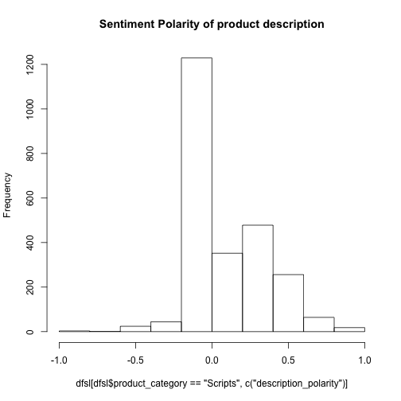

R 101: Introducción basada en ejemplos
========================================================
author: Denis Parra, PUC Chile
date: 5 de Agosto de 2016
autosize: true
transition: rotate

R y CRAN
========================================================

- R es "GNU S", un lenguaje de programación y ambiente para análisis estadístico.
<br/><br/>
- Pueden encontrar detalles del proyecto en el sitio web de [CRAN: Comprehensive R Archive Network](https://cran.r-project.org/)
<br/><br/>
- Además de ser libre, tiene una activa comunidad de desarrolladores que crea/actualiza paquetes (funcionalidad extendida), algunos de ellos muy utilizados como **dplyr** y **ggplot**.
<br/><br/>

RStudio
========================================================

- La consola tradicional de R no provee mucha funcionalidad, como sería esperable para un ambiente de análisis de datos y programación científica tipo MATLAB: acceso a documentación, variables y otras estructuras en memoria, soporte para visualización, etc.
<br/><br/>
- La herramienta gratuita [RStudio](https://www.rstudio.com/) ha sido exitosa en suplir esta carencia.
<br/><br/>
- En esta clase, entonces, usaremos RStudio para seguir los ejercicios.
<br/><br/>

Caso de Estudio: SL Marketplace
========================================================
rtl: true


¡Queremos Código!
========================================================

- Paso 1: cargar archivo y explorar datos
- Paso 2: visualizar
- Paso 3: explorar hipótesis específicas
- Paso 4: llevar a cabo tests, análisis más sofisticados

Paso 1
========================================================


```r
dfsl <- read.csv(file="sl_products_dsdpuc.csv", header = TRUE, stringsAsFactors = FALSE)

str(dfsl)
```

```
'data.frame':	15762 obs. of  9 variables:
 $ product_id          : int  2767 3215 3435 3641 3645 3647 3738 3865 3920 3954 ...
 $ product_name        : chr  "Spoke n' Cog Bear" "Brontosaurus Ride - a LOLO dinosaur" "3 Flying Fireflies: They explore a small area" "Shoulder Monkey: An Animated Pet" ...
 $ product_price_cat   : int  1 3 2 3 3 3 3 3 3 3 ...
 $ description_polarity: num  0.4 0.3088 -0.0844 -0.3 0.0856 ...
 $ product_avg_rating  : num  5 4.14 4.29 4.83 4.6 4.5 4.9 4.75 4.62 4.5 ...
 $ product_n_ratings   : int  1 7 14 6 5 14 10 4 26 12 ...
 $ store_id            : int  31 34 34 34 34 34 34 34 34 34 ...
 $ product_category    : chr  "Animals" "Animals" "Animals" "Animals" ...
 $ permissions         : int  4 0 0 0 0 0 0 0 0 0 ...
```

Paso 2
========================================================


```r
#install.packages("psych")
library(psych)
describe(dfsl)
```

```
                     vars     n       mean         sd    median    trimmed
product_id              1 15762 1197192.25 1163073.70 728368.00 1013829.25
product_name*           2 15762        NaN         NA        NA        NaN
product_price_cat       3 15762       2.66       1.18      3.00       2.57
description_polarity    4 15762       0.19       0.26      0.14       0.16
product_avg_rating      5 15762       4.20       1.09      4.67       4.43
product_n_ratings       6 15762       7.84      46.02      2.00       2.84
store_id                7 15762   28643.33   26781.26  21104.00   23823.64
product_category*       8 15762        NaN         NA        NA        NaN
permissions             9 15762       4.06       2.16      4.00       4.17
                           mad  min     max   range  skew kurtosis      se
product_id           710400.39 2767 4425358 4422591  1.18     0.18 9264.06
product_name*               NA  Inf    -Inf    -Inf    NA       NA      NA
product_price_cat         1.48    1       6       5  0.52    -0.30    0.01
description_polarity      0.20   -1       1       2  0.70     1.06    0.00
product_avg_rating        0.49    0       5       5 -1.64     2.08    0.01
product_n_ratings         1.48    0    3013    3013 33.44  1664.83    0.37
store_id              18244.88    7  131550  131543  1.65     2.51  213.32
product_category*           NA  Inf    -Inf    -Inf    NA       NA      NA
permissions               2.97    0       7       7 -0.38    -0.95    0.02
```

Paso 3
========================================================


```r
hist(dfsl[dfsl$product_category == "Scripts",c("description_polarity")], main="Sentiment Polarity of product description")
```



Paso 4
========================================================


```r
lm1 <- lm( product_avg_rating ~ product_category + description_polarity + product_price_cat + permissions ,data=dfsl)

summary(lm1)
```

```

Call:
lm(formula = product_avg_rating ~ product_category + description_polarity + 
    product_price_cat + permissions, data = dfsl)

Residuals:
    Min      1Q  Median      3Q     Max 
-4.7329 -0.3447  0.4183  0.6923  1.3729 

Coefficients:
                                 Estimate Std. Error t value Pr(>|t|)    
(Intercept)                      3.968817   0.032330 122.761  < 2e-16 ***
product_categoryArt              0.161549   0.025477   6.341 2.35e-10 ***
product_categoryAudio and Video -0.139803   0.035328  -3.957 7.62e-05 ***
product_categoryScripts         -0.356424   0.029585 -12.048  < 2e-16 ***
product_categoryVehicles        -0.108824   0.025088  -4.338 1.45e-05 ***
description_polarity            -0.049945   0.032635  -1.530   0.1259    
product_price_cat                0.129430   0.007817  16.558  < 2e-16 ***
permissions                     -0.010678   0.004176  -2.557   0.0106 *  
---
Signif. codes:  0 '***' 0.001 '**' 0.01 '*' 0.05 '.' 0.1 ' ' 1

Residual standard error: 1.069 on 15754 degrees of freedom
Multiple R-squared:  0.039,	Adjusted R-squared:  0.03858 
F-statistic: 91.35 on 7 and 15754 DF,  p-value: < 2.2e-16
```


Slide With Plot
========================================================


